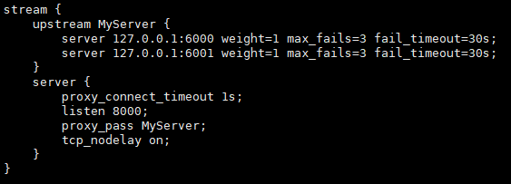
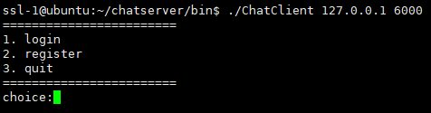
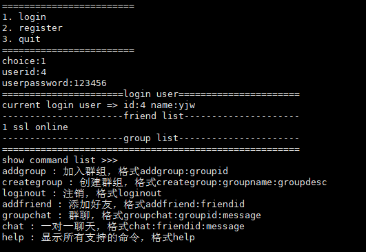
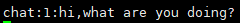
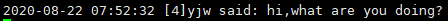

# chatserver
## 项目介绍
基于muduo库实现的聊天服务器，支持集群部署。  
项目所实现的功能：客户端新用户注册、客户端用户登录、添加好友和添加群组、好友聊天、群组聊天、离线消息、nginx配置tcp负载均衡、集群聊天系统支持客户端跨服务器通信。  
项目所需技术栈：Json序列化和反序列化、muduo网络库开发、nginx环境部署和tcp负载均衡器配置、基于发布-订阅的服务器中间件redis消息队列编程实践、MySQL数据库编程、CMake构建编译环境。  
目的：学习c++网络编程，通过项目巩固学习过的知识，并且学习使用一些中间件技术。
## 环境依赖
- 安装boost库和muduo库  
- 安装redis和hiredis开发包
- 安装mysql和mysql开发包
- 安装nginx
- 安装cmake环境
## 部署步骤
### 单机部署
1. 执行./autobuild.sh
2. 启动mysql服务  
   `service mysqld start`
3. 执行sqlfile/目录下的mysql脚本文件，创建数据库
   `source ./sqlfile/database.sql`
4. 执行bin/目录下ChatServer命令，启动服务器  
   `./ChatServer 127.0.0.1 6000`  
5. 执行bin/目录下ChatClient命令，启动客户端  
   `./ChatClient 127.0.0.1 6000`  
### 集群部署
1. 执行./autobuild.sh
2. 启动mysql服务并创建数据库  
3. 启动redis
4. 配置nginx，配置如下：  
   <div align=center></div>
5. 启动nginx
6. 开启两个chat服务器，分别在6000和6001端口  
   `./ChatServer 127.0.0.1 6000`  
   `./ChatServer 127.0.0.1 6001`
7. 启动客户端连接nginx服务器  
   `./ChatClient 127.0.0.1 80`
## 客户端使用命令
- help：显示所有支持的命令，格式
  `help`  
- chat:发送聊天信息，格式
  `chat:friendid:message`    
- addfriend:添加好友，格式
  `addfriend:friendid`
- creategroup:创建群组，格式
  `creategroup:groupname:groupdesc`
- addgroup:加入群组，格式
  `addgroup:groupid`
- groupchat:群聊，格式
  `groupchat:groupid:message`  
- loginout:注销，格式
  `loginout`
## 目录结构
```
chatserver:
│  autobuild.sh		#自动构建脚本
│  CMakeLists.txt
│  README.md
│  
├─bin			#生成的可执行文件
│      .gitkeep
│      
├─build			#构建目录
│      .gitkeep
│      
├─image		#readme图片
│      chat1.png
│      chat2.png
│      nginx配置.png
│      主界面.png
│      启动界面.png
│      
├─include			#头文件目录
│  │  public.hpp
│  │  
│  └─server
│      │  chatserver.hpp
│      │  chatservice.hpp
│      │  
│      ├─db
│      │      db.h
│      │      
│      ├─model
│      │      friendmodel.hpp
│      │      group.hpp
│      │      groupmodel.hpp
│      │      groupuser.hpp
│      │      offlinemessagemodel.hpp
│      │      user.hpp
│      │      usermodel.hpp
│      │      
│      └─redis
│              redis.hpp
│              
├─sqlfile     #sql脚本，创建数据库
│      datebase.sql
│              
├─src			#源文件
│  │  CMakeLists.txt
│  │  
│  ├─client
│  │      CMakeLists.txt
│  │      main.cpp
│  │      
│  └─server
│      │  chatserver.cpp
│      │  chatservice.cpp
│      │  CMakeLists.txt
│      │  main.cpp
│      │  
│      ├─db
│      │      db.cpp
│      │      
│      ├─model
│      │      friendmoel.cpp
│      │      groupmodel.cpp
│      │      offlinemessagemodel.cpp
│      │      usermodel.cpp
│      │      
│      └─redis
│              redis.cpp
│              
└─thirdparty		#第三发工具
        json.hpp
```
## 项目展示
- 启动界面  
  <div></div>
- 主界面  
   <div></div>
- 聊天功能
   <div >
   
   
   </div>